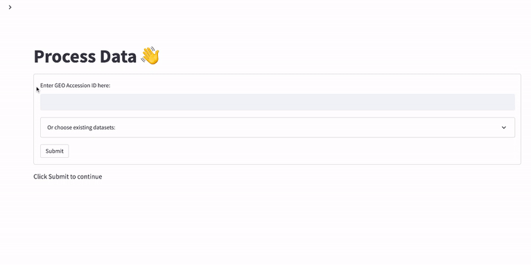
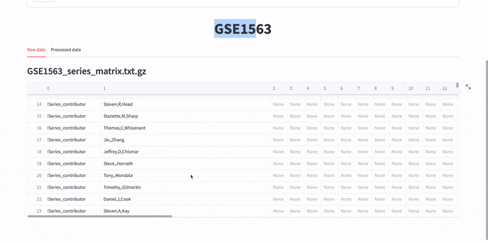
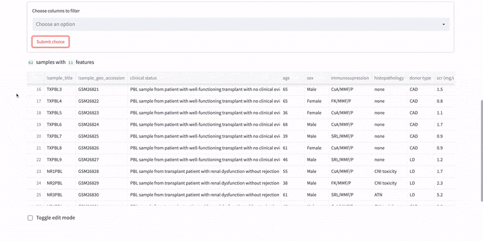
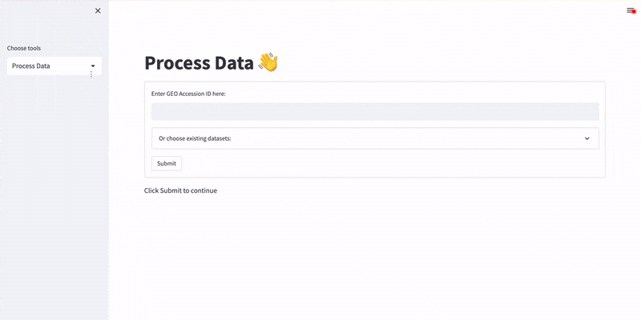
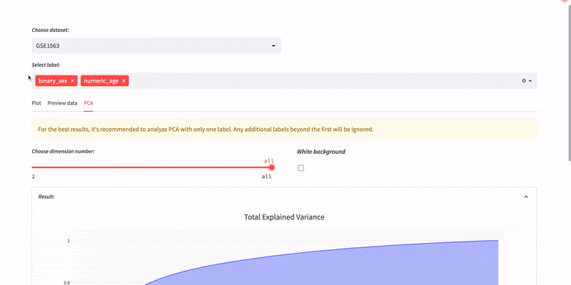
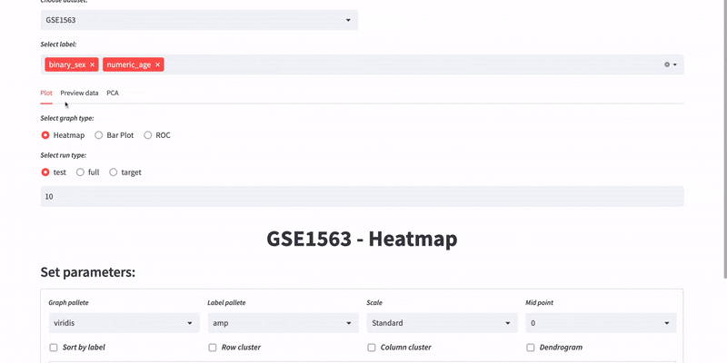
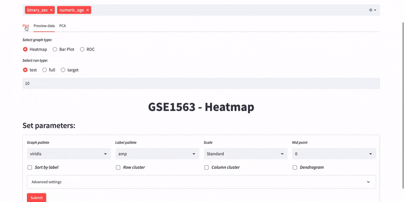
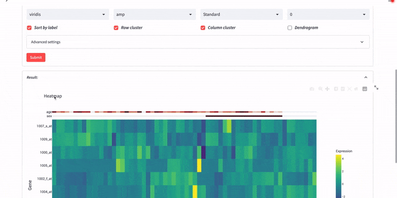

# Demo-GEO-dataprocess-streamlit

## 1. Derive GEO files from <https://www.ncbi.nlm.nih.gov/geo/> by Accession ID

  

## 2. Raw and processed data

- Column filter of clinical data

  

- Edit mode of clinical data and export files

  

## 3. Plot page

  

- Preview data

  

- PCA analysis

  

- Heatmap

  

- Dendrogram

  

